# Banking Transfer Management System

## Table of Contents
- [Introduction](#introduction)
- [Technologies Used](#technologies-used)
- [Architecture](#architecture)
- [Microservices](#microservices)
    - [Beneficiary Service](#beneficiary-service)
    - [Transfer Service](#transfer-service)
    - [Chatbot Service](#chatbot-service)
    - [Gateway Service](#gateway-service)
    - [Discovery Service](#discovery-service)
    - [Config Service](#config-service)
- [Installation](#installation)
- [Usage](#usage)
- [Testing](#testing)
- [Future Work](#future-work)
- [Contributing](#contributing)
- [License](#license)
- [Screen Shots](#screen-shots)

## Introduction
This project is a proof of concept for a banking transfer management system. It is built using a microservices architecture to facilitate web and mobile transactions for banking clients. The application consists of several microservices that manage beneficiaries, bank transfers, and user interactions through an AI-powered chatbot.

## Technologies Used
- **Backend:**
    - Spring Boot
    - Spring Cloud
    - OpenFeign
    - Spring AI (or Python Langchain for Chatbot)
- **Frontend:**
    - Angular or React
- **Database:**
    - [Specify the database used, e.g., MySQL, PostgreSQL, MongoDB, etc.]
- **Other Technologies:**
    - Docker
    - Jenkins
    - Kubernetes (optional for deployment)

## Architecture
The application follows a microservices architecture with the following components:
- Beneficiary Service
- Transfer Service
- Gateway Service
- Discovery Service
- Config Service


## Microservices

### Beneficiary Service
This microservice manages beneficiaries' information, including their name, RIB, and type (physical or moral). It provides RESTful endpoints to create, read, update, and delete beneficiaries.

### Transfer Service
This service handles bank transfers, allowing users to initiate transactions. It maintains transfer records, including details such as the amount, source RIB, beneficiary ID, and transfer type (normal or instant).

### Chatbot Service
The AI-powered chatbot assists users in querying banking services and processes inquiries based on provided documents (e.g., PDF). It utilizes a generative AI model (e.g., GPT-4 or LLaMA 3) with a Retrieval-Augmented Generation (RAG) system.

### Gateway Service
This service acts as an API gateway, routing requests to the appropriate microservices and handling authentication and authorization.

### Discovery Service
The discovery service facilitates service registration and discovery within the microservices architecture, using Eureka or Consul.

### Config Service
This service manages application configuration settings for the microservices, enabling dynamic configuration updates.

## Installation
To set up the project locally, follow these steps:

1. Clone the repository:
   ```bash
   git clone https://github.com/yourusername/yourrepository.git

## Screen Shots
### Beneficaire Service
### Project Structure
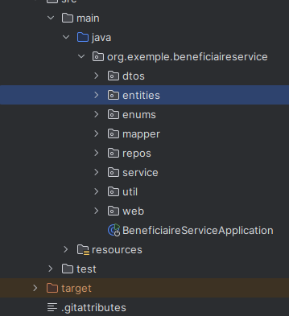

Entity:

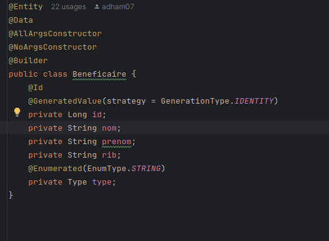

Enums:

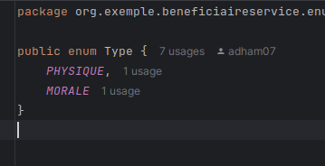

Dtos:

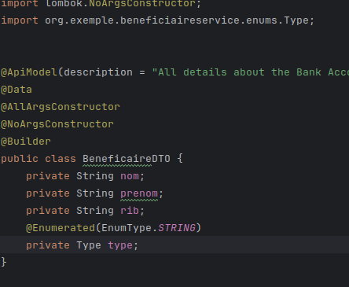

Mapper (Modal Mapper):

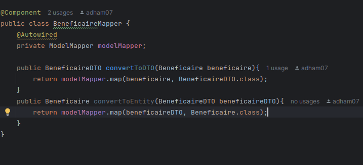

Mapper config:

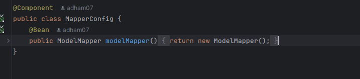

Repo:

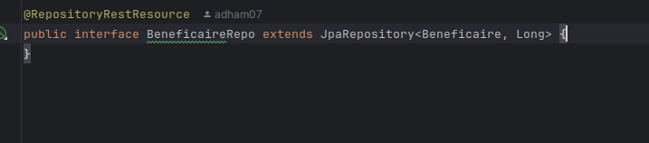

Service:

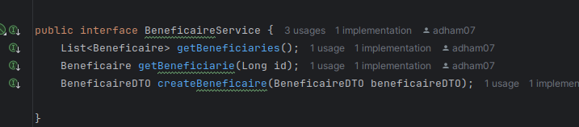

Implementation: 

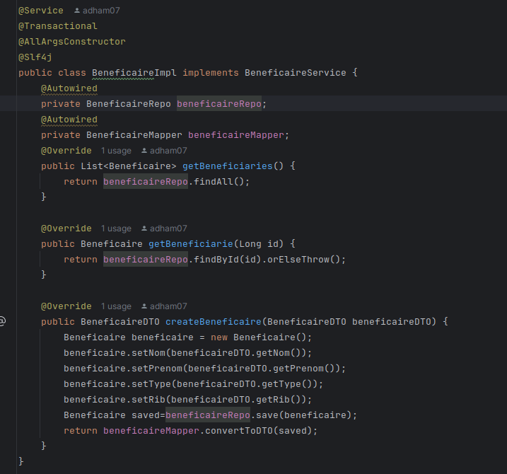

Controller:

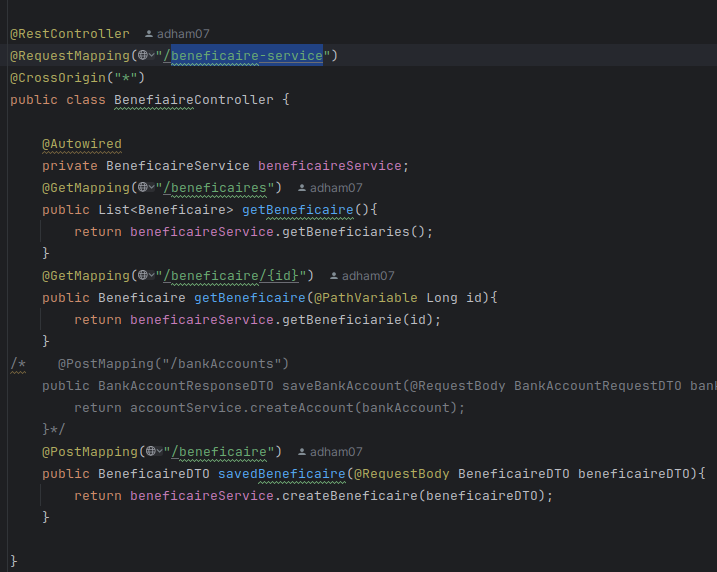

Application:

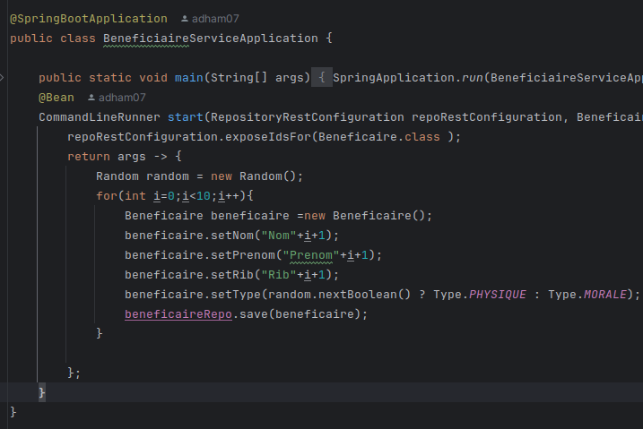

Discovery Service

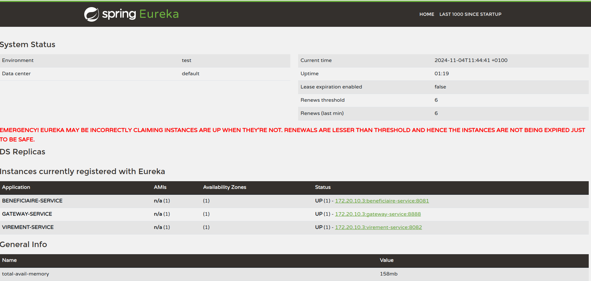

Gateway

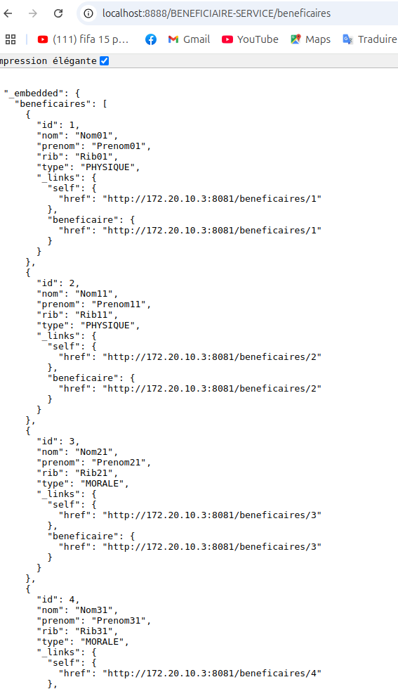

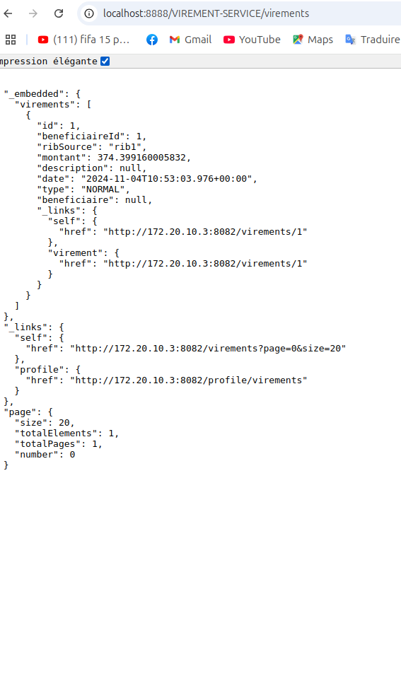

## Documentation Swagger
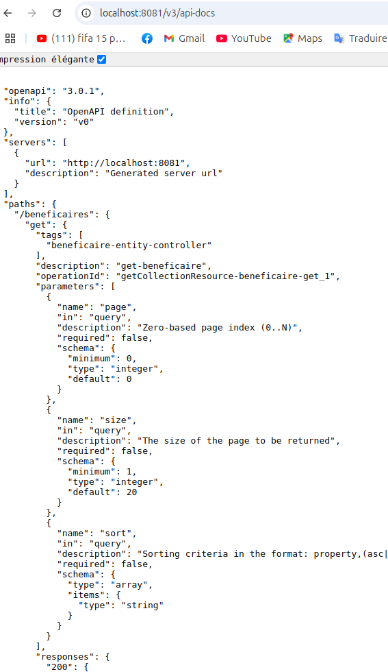

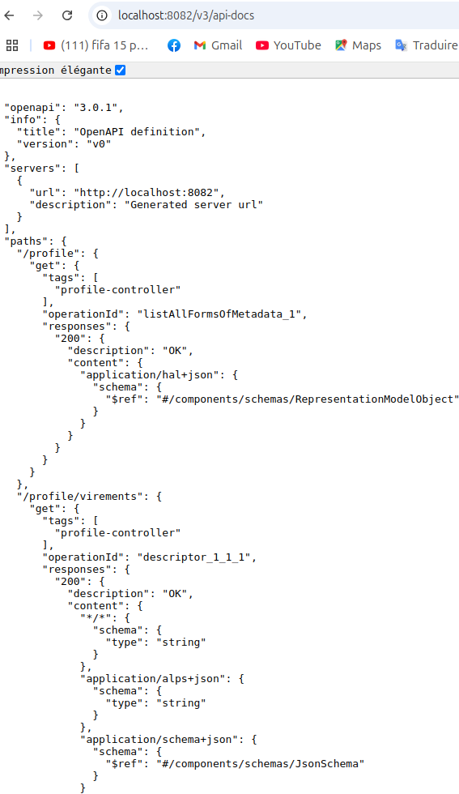
## FRONT
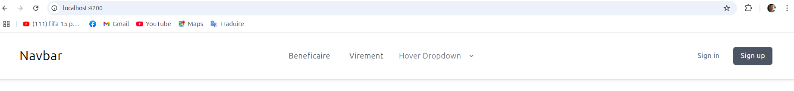

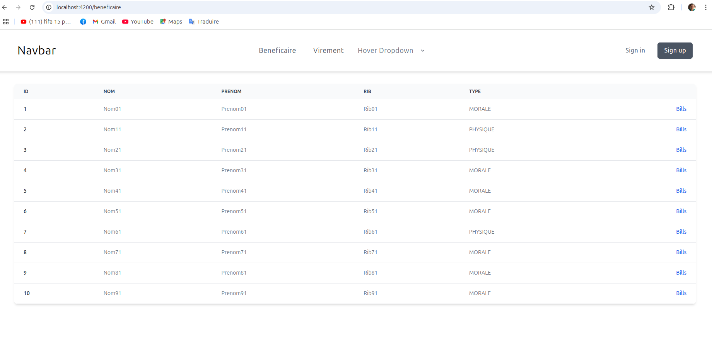